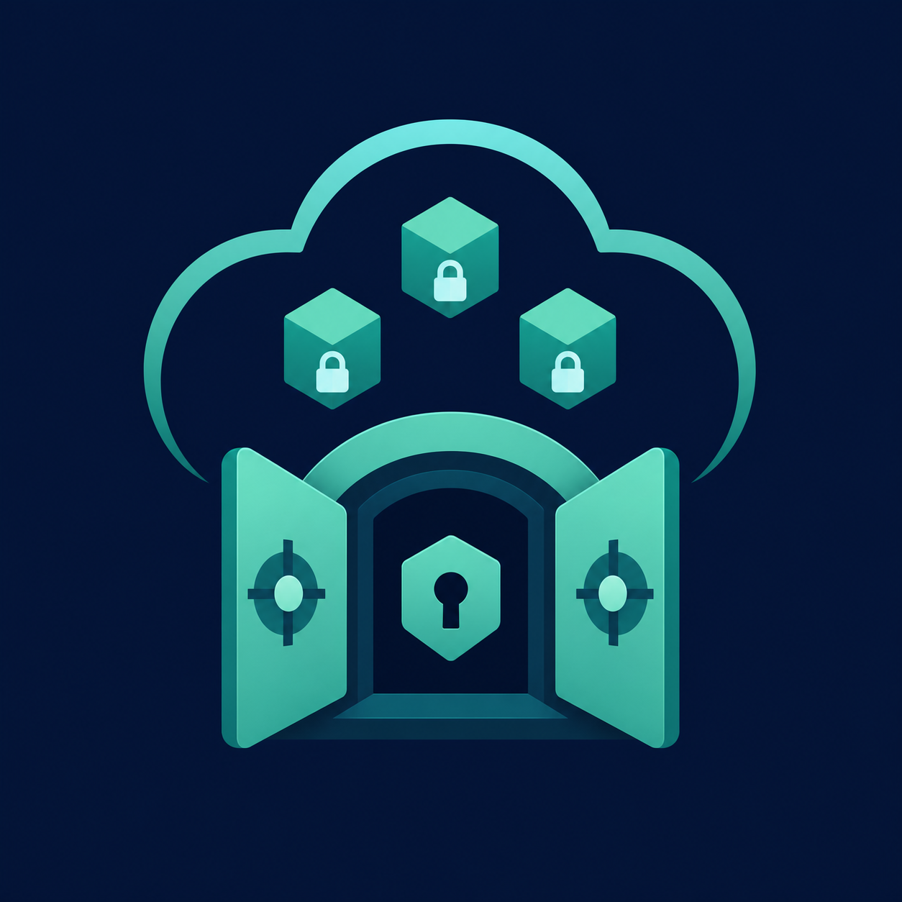

# TeleDrive Lite


> 本项目由 OpenAI Codex 根据项目维护者提供的需求设计并实现。项目维护者负责需求定义、代码审查、测试、发布和后续维护。

> This project was designed and implemented with OpenAI Codex based on requirements provided by the project maintainer. The maintainer is responsible for requirements, code review, testing, releases, and ongoing maintenance.

TeleDrive Lite 是一个原生 Android 加密个人云盘：文件在设备本地使用 AES-256-GCM 加密并分块，然后通过 Telegram 官方 Bot API 直接发送到用户自己的私人频道。应用不需要自建服务器、`api_id`、`api_hash`、手机号验证码或 Telegram 用户账号登录。



## 当前状态

版本：`0.1.0-alpha`。核心加密、上传、下载、加密置顶索引、跨设备恢复、安全删除和本地管理流程已实现。项目仍为 alpha，尚未经过正式第三方安全审计，不应作为唯一备份。

## 功能

- Bot Token、私人频道 Chat ID 和同步密码首次配置与验证
- 自动检测私人频道候选，由用户确认
- Android Keystore 保护 Token 和本机会话主密钥
- 每文件独立随机数据密钥、每块独立随机 nonce
- PBKDF2-HMAC-SHA256（随机 salt、600,000 次）派生主密钥
- 18 MiB 默认流式分块，可在安全范围内配置
- WorkManager 串行上传/下载、前台通知、进度、取消和安全重试
- Room 本地缓存、多级虚拟目录、搜索、排序、重命名、任意目标移动和批量操作
- 加密置顶索引、原子替换、跨设备恢复和版本校验
- SHA-256 完整性验证与 AES-GCM 认证失败保护
- 安全删除、部分失败恢复、非空文件夹递归删除和孤立块清理
- 浅色、深色和跟随系统主题
- 脱敏诊断导出、清理缓存、退出并清除凭据

## 工作原理与架构

```text
Storage Access Framework
        │ plaintext stream
        ▼
SHA-256 + chunker → AES-256-GCM → Telegram Bot API → private channel
        │                                      │
        └──────── Room transfer journal ───────┘
                              │
                              ▼
              encrypted pinned index (authoritative recovery map)
```

Compose UI 只调用 ViewModel；Repository/Store 管理 Room 事务；Worker 执行长任务；Telegram 客户端统一处理 HTTP、`ok=false`、超时和 `retry_after`；加密模块不依赖 UI 或网络。

### 数据流

上传先对源文件做流式预哈希和分块摘要，再逐块加密上传。只有全部分块上传成功且新索引已置顶确认后，文件才标记为 `AVAILABLE`。下载逐块拉取、验证远端长度、执行 GCM 认证、写入 SAF Uri，最终 SHA-256 一致才提交成功。

### 安全设计

- 文件正文永远不直接使用同步密码加密。
- 同步密码派生主密钥；主密钥只包装每文件随机数据密钥。
- 原始文件名和目录名只存在于加密索引，不进入 Telegram 分块文件名。
- Telegram 分块名为 `td_<UUID>_<固定宽度序号>.bin`。
- Token、密码、主密钥和数据密钥不写日志、不写源码。
- GCM 认证或最终 SHA-256 失败会停止恢复并清除不可信输出。
- 诊断信息不包含完整 Chat ID、频道名、Token、密码、密钥、下载 URL或文件内容。

### 加密格式

正文使用 AES-256-GCM；每块包含 12 字节随机 nonce 和 128 位认证标签。索引也使用带版本头和 KDF 参数的 AES-GCM 信封。格式包含版本字段，为未来迁移保留入口。

### 密钥派生

当前实现使用 `PBKDF2WithHmacSHA256`、16 字节随机 salt、600,000 次迭代、256 位输出。salt、算法名、迭代数和密钥长度存入加密索引；同步密码本身从不持久化。密码丢失后没有恢复后门。

### 加密置顶索引与恢复

Bot API 不能可靠遍历私人频道全部历史，因此应用不扫描历史作为恢复主方案。它上传 `teledrive_index_v1.bin`，验证候选、置顶、再次 `getChat` 确认后才提交新 revision；旧索引只在新索引确认后清理。新设备使用相同 Token、Chat ID 和同步密码下载、认证、解密置顶索引，并把远端 KDF 参数重新绑定到本机 Keystore 会话。

## Telegram Bot API 限制

- 截至 2026-07-16，官方文档说明 [`getFile`](https://core.telegram.org/bots/api#getfile) 下载上限为 20 MB，[`sendDocument`](https://core.telegram.org/bots/api#senddocument) multipart 上传上限为 50 MB。
- 当前安全默认块为 18 MiB；加密块必须严格小于 20,000,000 字节下载边界。
- 同时只上传一个文件，块按序发送，避免触发限流。
- 幂等读取可有限重试；非幂等上传结果未知时不会盲目重发。
- Bot 必须是私人频道管理员，并具备发送、编辑/置顶和删除消息权限；置顶要求以官方 [`pinChatMessage`](https://core.telegram.org/bots/api#pinchatmessage) 权限说明为准。
- Telegram 服务限制或策略可能变化；发布前应复核官方 Bot API 文档。

## 系统要求

- Android 9（API 28）或更高
- JDK 17
- Android SDK 36
- 网络可访问 Telegram Bot API
- 用户自己的 Telegram Bot 和私人频道

## 准备 Telegram

### 1. 创建机器人

在 Telegram 打开 `@BotFather`，发送 `/newbot`，按提示创建机器人并复制 Token。Token 等同密码，不要提交到 Issue、截图或日志。

### 2. 创建私人频道

新建频道并选择“私人频道”。本项目不支持用公开频道隐藏私人文件元数据的安全假设。

### 3. 设置管理员权限

把 Bot 加入频道并设为管理员，允许发送文件/消息、编辑或置顶消息、删除消息。应用内“测试频道”会发送并立即删除一条测试消息。

### 4. 获取 Chat ID

在频道发送一条新消息，然后使用应用的“自动检测频道”；应用只显示 `channel_post` 候选并要求人工确认。也可手动输入以 `-100` 开头的私人频道 ID。

## 配置应用

输入 Token、私人频道 Chat ID、至少 8 位且唯一的同步密码并再次确认。建议把同步密码离线备份；丢失后任何设备都无法恢复文件。

## 上传、下载与管理

- 首页使用明确的“上传文件”和“新建文件夹”入口，可多选任意类型文件。
- 文件上传到当前虚拟目录，默认块大小可在设置调整；传输队列以中文显示状态、进度、字节数和速度。
- 文件卡片提供“下载”主操作，随后用系统创建文档界面选择保存位置；详情、重命名、移动和删除位于“更多”。
- 首页支持多级目录、搜索以及名称、大小、时间排序。
- 进入“批量管理”后才显示复选框，并可全选、批量移动或批量安全删除。
- 确认文件删除后，条目会立即从目录和搜索结果隐藏，云端加密分块与索引在后台安全清理。
- 删除会先保留所有 `message_id` 并逐块处理；部分失败的文件会重新显示为“删除未完成”，可继续重试。

## 在新设备恢复

先用相同 Token 和 Chat ID 完成连接配置，再从设置进入“从置顶索引恢复”，输入原同步密码。恢复前会验证格式、GCM 认证、索引自指针和两次置顶结果；失败不会把任务标记为成功。

## 构建 Debug APK

```bash
./gradlew test
./gradlew lint
./gradlew assembleDebug
```

Windows 使用：

```powershell
.\gradlew.bat test
.\gradlew.bat lint
.\gradlew.bat assembleDebug
```

APK 位于 `app/build/outputs/apk/debug/app-debug.apk`。

## 创建 Release Keystore 与签名 APK

项目不提交签名材料，也不自动创建正式 Release。维护者可在安全离线环境使用 `keytool` 创建自己的 keystore，在未纳入版本控制的 `keystore.properties` 中配置签名，然后为 `release` build type 增加本地签名配置。不要把 `.jks`、别名密码或仓库密码提交到 Git。

## 运行测试

```bash
./gradlew testDebugUnitTest
./gradlew compileDebugAndroidTestKotlin
./gradlew lintDebug
```

网络测试使用 MockWebServer，不连接真实 Telegram，不使用真实 Token 或频道。Android 仪器测试覆盖 Room DAO 和迁移；需要连接模拟器或 API 28+ 设备运行 `connectedDebugAndroidTest`。

## 项目结构

```text
app/src/main/java/com/teledrive/lite/
├── crypto/       AES-GCM、KDF、密钥包装
├── telegram/     Bot API 客户端和错误模型
├── database/     Room 实体、DAO、迁移
├── repository/   文件、目录和传输事务
├── upload/       流式上传与 Worker
├── download/     下载、解密、SAF 输出
├── deletion/     安全删除和孤立块清理
├── index/        索引模型、序列化、验证
├── sync/         置顶索引原子更新与恢复
├── settings/     Keystore 配置和用户偏好
├── ui/           Compose 页面与 ViewModel
└── navigation/   应用导航
```

## 常见问题

### Bot Token 泄露怎么办？

立即在 `@BotFather` 撤销/重新生成 Token，然后在应用中验证并更新连接。公开历史中出现过的 Token 应视为永久泄露。

### 同步密码丢失怎么办？

无法恢复。开发者、Telegram 和 OpenAI 都没有后门或密钥托管。

### 私人频道被删除怎么办？

远端密文和置顶索引会一并丢失。请保留独立备份。

### 为什么不能只扫描频道历史？

Bot API 不保证完整遍历私人频道历史，因此置顶加密索引是权威恢复入口。

## 数据备份建议

Telegram 不应作为唯一备份。至少保留一份离线原文件或其他受信任的加密备份，并离线保存同步密码。定期在备用 Android 设备验证恢复流程。

## 隐私

应用没有开发者中转服务器、用户注册、广告、分析 SDK 或社交功能。文件从设备直接传到用户自己的私人频道。Telegram 仍能观察 Bot/频道交互、密文大小、时间和块数量等流量元数据。

## 已知限制

- Alpha 版本，未经过正式第三方安全审计。
- SAF 提供者能力不同；崩溃时可能暂时留下零字节或部分文档，重试会从零截断重写。
- Bot API 的上传/下载限制和错误文本可能变化。
- 删除请求响应丢失时依赖后续“消息不存在”响应确认幂等成功。
- Debug APK 未签名为正式发布版本。

## 开源许可证

代码以 [Apache License 2.0](LICENSE) 发布。第三方依赖见 [THIRD_PARTY_NOTICES.md](THIRD_PARTY_NOTICES.md)。

## 贡献

请阅读 [CONTRIBUTING.md](CONTRIBUTING.md)、[CODE_OF_CONDUCT.md](CODE_OF_CONDUCT.md) 和 [SECURITY.md](SECURITY.md)。不要在公开 Issue 中附带真实 Token、Chat ID、数据库或加密索引。

## Codex 使用说明

初始架构与实现由 OpenAI Codex 在维护者需求指导下创建。实际作用、验证记录和人工检查项见 [CODEX.md](CODEX.md)。Codex 生成代码不代表 OpenAI 认证、担保或安全审计。

## 免责声明

本项目独立维护，不是 Telegram 官方产品，也不是 OpenAI 官方产品，与 Telegram 或 OpenAI 无隶属关系。使用者自行承担数据丢失、账号限制、服务变化和安全风险。

## English summary

TeleDrive Lite is a native Android encrypted personal cloud drive that streams AES-256-GCM encrypted chunks directly to the user's own private Telegram channel using only the official Bot API. It requires no developer-operated server, `api_id`, `api_hash`, phone login, ads, analytics, or account system. It is an unaudited alpha project; keep independent backups and never lose the sync password.
